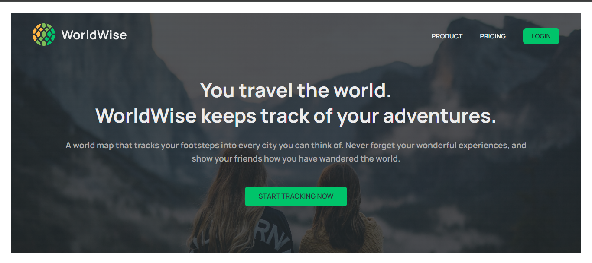

# Forkify

<div id="top"></div>


<!-- PROJECT LOGO -->
<br />
<div align="center">
  <a href="https://worldwise-track-app.vercel.app/">
    
  </a>

  <h3 align="center">Use Popcorn</h3>

  <p align="center">
    <a href="https://worldwise-track-app.vercel.app/">View Demo</a>
    ·
    <a href="https://github.com/MoazElsayedMohamed/Worldwise/issues">Report Bug</a>
  </p>
</div>

<!-- TABLE OF CONTENTS -->
<details>
  <summary>Table of Contents</summary>
  <ol>
    <li>
      <a href="#about-the-project">About The Project</a>
      <ul>
        <li><a href="#features">Features</a></li>
        <li><a href="#built-with">Built With</a></li>
        <li><a href="#flowchart">Flowchart</a></li>
        <li><a href="#architecture">Architecture</a></li>
      </ul>
    </li>
    <li>
      <a href="#getting-started">Getting Started</a>
      <ul>
        <li><a href="#installation">Installation</a></li>
        <li><a href="#tree-structure">Tree Structure</a></li>
      </ul>
    </li>
    <li><a href="#contributing">Contributing</a></li>
    <li><a href="#acknowledgments">Acknowledgments</a></li>
  </ol>
</details>

<!-- ABOUT THE PROJECT -->

## About The Project



Worldwise is atracking web app using the clicking on the map to track, find, and add city to tracking list.

### Features

| User Stories      | Features                                                                                                                                |
| ----------------- | --------------------------------------------------------------------------------------------------------------------------------------- |
| Search for cities | <ul><li>functionality: start by clicking on map and tracking cities <li>Display results in list<li>Display city with country flag </ul> |
| display cities    | <ul><li>track cities and display in list of tracking cities and can be displayed in country list also</ul>                              |

<p align="right">(<a href="#top">back to top</a>)</p>

---

### Built With

- [HTML](https://html.com/)
- [CSS](https://www.w3schools.com/css/)
- [React](https://www.npmjs.com/package/react)
- Libraries
  - [react-router-dom](https://www.npmjs.com/package/react-router-dom)
  - [react-datepicker](https://www.npmjs.com/package/react-datepicker)
  - [react-leaflet](https://www.npmjs.com/package/react-leaflet)

---

<!-- GETTING STARTED -->

## Getting Started

This project require some prequesites and dependenscies to be installed, you can view it online using this [demo](https://worldwise-track-app.vercel.app/). or you can find the instructions below

> To get a local copy, follow these simple steps :

### Installation

1. Clone the repo
   ```sh
   git clone https://github.com/MoazElsayedMohamed/Worldwise
   ```
2. Go to project folder

```bash
cd Worldwise
```

3. install dependencies

```bash
npm install
```

4. Run start script

```bash
npm start
```

#### Tree structure

```
usePopcorn
│   .gitignore
│   .eslintrc.json
│   index.html
│   package-lock.json
│   package.json
│   preview.png
│   README.md
│   vite.config.js
│
└───public
│    bg.jbg
│    icon.png
│    img-1.jpg
│    img-2.jpg
│    logo.png
│    vite.svg
│
└───src
    App.jsx
    index.css
    main.jsx
    assets
    │       react.svg
    components
    │       AppNav.jsx
    │       AppNav.module.css
    │       Button.jsx
    │       Button.module.css
    │       ButtonBack.jsx
    │       City.jsx
    │       City.module.css
    │       CityItem.jsx
    │       CityItem.module.css
    │       CityList.jsx
    │       CityList.module.css
    │       CountryItem.jsx
    │       CountryItem.module.css
    │       CountryList.jsx
    │       CountryList.module.css
    │       Form.jsx
    │       Form.module.css
    │       Logo.jsx
    │       Logo.module.css
    │       Map.jsx
    │       Map.module.css
    │       Message.jsx
    │       Message.module.css
    │       PageNav.jsx
    │       PageNav.module.css
    │       Sidebar.jsx
    │       Sidebar.module.css
    │       Spinner.jsx
    │       Spinner.module.css
    │       SpinnerFullPage.jsx
    │       SoinnerFullPage.module.css
    │       User.jsx
    │       User.module.css
    │
    contexts
    │       CitiesContext.jsx
    │       FakeAuthContext.jsx
    hooks
    │       useGeolocaion.js
    │       useUrlPosition.js
    hooks
    │       AppLayout.jsx
    │       AppLayout.module.css
    │       HomePage.jsx
    │       HomePage.module.css
    │       Login.jsx
    │       Login.module.css
    │       PageNotFound.jsx
    │       Pricing.jsx
    │       Product.jsx
    │       Product.module.css
    │       ProtectedRoute.jsx


```

<p align="right">(<a href="#top">back to top</a>)</p>

<!-- CONTRIBUTING -->

## Contributing

Contributions are what make the open source community such an amazing place to learn, inspire, and create. Any contributions you make are **greatly appreciated**.

If you have a suggestion that would make this better, please fork the repo and create a pull request. You can also simply open an issue with the tag "enhancement".
Don't forget to give the project a star! Thanks again!

1. Fork the Project
2. Create your Feature Branch (`git checkout -b feature/AmazingFeature`)
3. Commit your Changes (`git commit -m 'Add some AmazingFeature'`)
4. Push to the Branch (`git push origin feature/AmazingFeature`)
5. Open a Pull Request

<p align="right">(<a href="#top">back to top</a>)</p>

<!-- ACKNOWLEDGMENTS -->

## Acknowledgments

- [Jonas schmedtmann](https://github.com/jonasschmedtmann)
